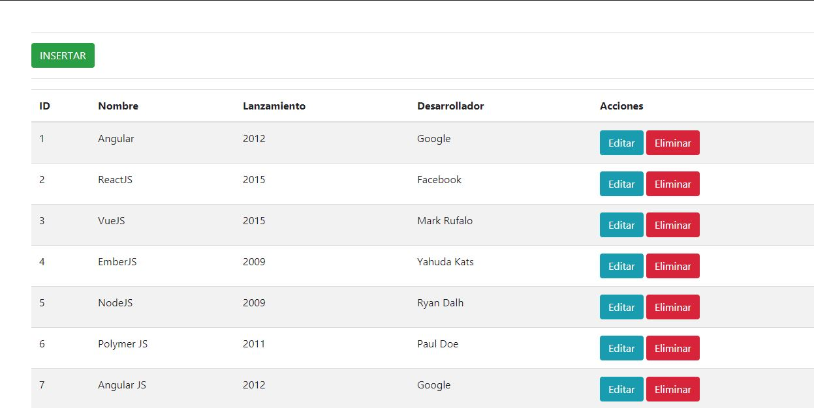

# React-PHP-CRUD
Simple CRUD utilizando una API desarrollada en PHP, base de datos MySQL y React para el frontend
# Como utilizarlo
```
  -Primero restauren la BD 
  -Luego BD.php cambien las credenciales de acceso
  -Luego en la abren una consola y acceden a la carpeta vista
  -Ejecutan npm install para instslar las dependencias necesarias
  -Ya que está descargado todo ejecutan npm start
  - Van a http://localhost:3000/  
```


# Screenshot

